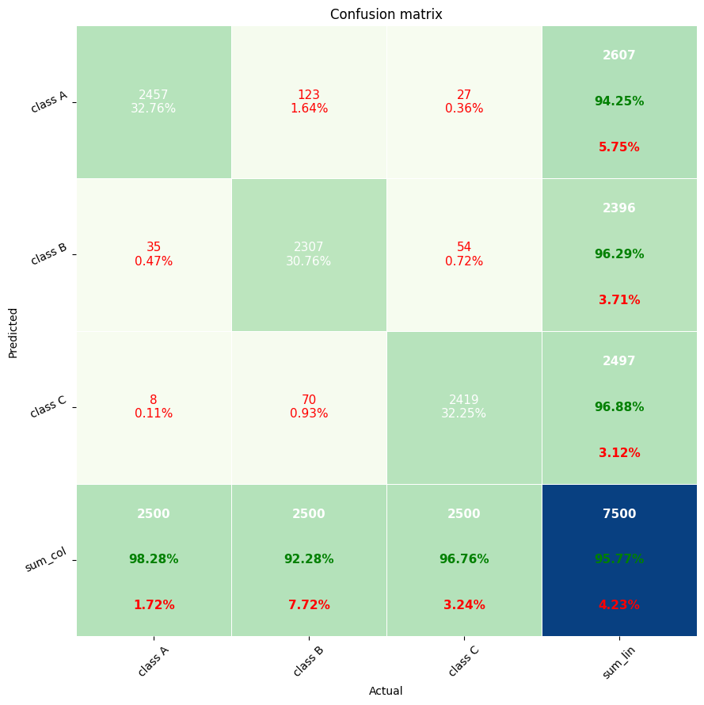
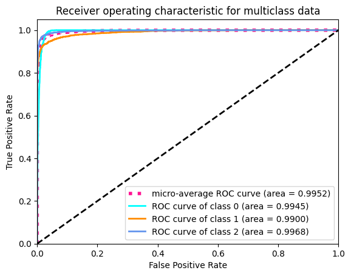

## __Common Test I. Multi-Class Classification__

An Implementation of pretrained MobileNetV3 using PyTorch for classifying the images into lenses using PyTorch.

### **Dataset**:
The Dataset consists of three classes, strong lensing images with no substructure, subhalo substructure, and vortex substructure. The images have been normalized using min-max normalization.

### **Solution**:
The notebook can be open on [GoogleColab](https://colab.research.google.com/drive/1lJTy1PWsbkNAykuz6oRYMKkvjbqJKis-?usp=sharing)

### **Augmentations**:

1. Random Horizontal Flip
2. Random Vertical Flip
3. Random Rotation
4. Center Crop

I've used the previosly mentioned augmentations to double the size of the dataset, which resulted in significant improvments in the validation accuracy and AUC metrics.

### **Model Weights**: [classification_model.pth](/weights/classification_model.pth)

 

## **Results**:

| S.No | Metric              | Value  |
| ---- | ------------------- | ------ |
| 1.   | Validation Accuracy | 95.93% |
| 2.   | macro-average AUC   | 0.99378|
| 2.   | micro-Average AUC   | 0.9952 |
| 3.   | AUC (no)            | 0.9937 |
| 4.   | AUC (sphere)        | 0.99   |
| 5.   | AUC (Vortex)        | 0.9967 |

#### **Confusion Matrix**:

#### **ROC Curve**:

 