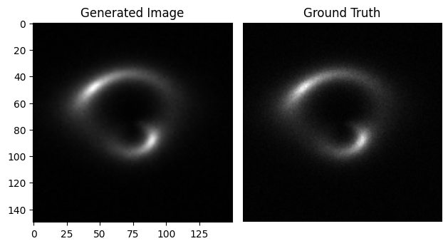
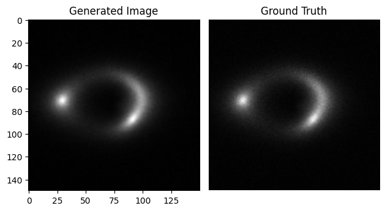

# __GSoC-2023__

This repo provides solution used for the application process for GSoC DeepLense 2023.  

## __Common Test I. Multi-Class Classification__

An Implementation of pretrained MobileNetV3 using PyTorch for classifying the images into lenses using PyTorch.

### **Dataset**:
The Dataset consists of three classes, strong lensing images with no substructure, subhalo substructure, and vortex substructure. The images have been normalized using min-max normalization.

### **Solution**:
The notebook can be open on [GoogleColab](https://colab.research.google.com/drive/1lJTy1PWsbkNAykuz6oRYMKkvjbqJKis-?usp=sharing)

### **Model Weights**: [classification_model.pth](/weights/classification_model.pth)

### **Results**:

| S.No | Metric              | Value  |
| ---- | ------------------- | ------ |
| 1.   | Validation Accuracy | 93.56% |
| 2.   | Micro Average AUC   | 0.9884 |
| 3.   | AUC (no)            | 0.9909 |
| 4.   | AUC (sphere)        | 0.9820 |
| 5.   | AUC (Vortex)        | 0.9913 |

#### **confusion matrix**:

#### **ROC Curve**:

 

## __Specific Test VI. Image Super-resolution__

An Implementation of SRResNet using PyTorch for super-resolution of images.[^1]

### Trails

1. Implemented a discriminator in the structure mentioned in the paper, and optimized the generator network with **adversarial loss**, but didn’t find any significant improvements. Not to mention the extended training time due to the need of optimizing the discriminator.

2. Implemented **VGG-Content loss** to capture perceptual similarity between images and penalize the network with the MSE loss between the embeddings of the upscaled image and its ground truth. I also didn’t find any significant improvements, whilst the training time took longer due to the need of inferring a VGG-19 Network in every training step.

3. Removed batch normalization following the findings of the follow up architecture **“ESRGAN”**[^2] that BN layers produce visible artifacts in the upscaled image. and found significant improvements in the resulting upscaled images and corresponding PNSR and SSIM metrics.

4. Changed the LeakyReLU activation function to **PReLU** activation function, which resulted in a minor improvement in the validation metrics.

5. Implemented **Learning Rate Scheduler** that decreased the LR by a factor of **0.1** if no improvements in validation loss occurred within an Epoch. resulted in a minor improvment with no real damage to the training time.

### **Dataset**:
The dataset comprises strong lensing images with no substructure at multiple resolutions: high-resolution (HR) and low-resolution (LR).

### **Solution**:
The notebook can be open on [GoogleColab](https://colab.research.google.com/drive/1UOhPnVv-YDzBvhI5va-PipOj3BV9LHMT?usp=sharing)

### **Model Weights**: [superres.pth](/weights/superres.pth)

### **Results**:
| S.No | Metric          | Value    |
| ---- | --------------- | -------- |
| 1.   | Validation MSE  | 5.92e-5  |
| 2.   | Validation PSNR | 42.2755508  |
| 3.   | Validation SSIM | 0.9829  |  

#### **Generated Images vs Ground Truth**:

## __Citation__

[^1]: [Photo-Realistic Single Image Super-Resolution Using a Generative Adversarial Network](https://arxiv.org/abs/1609.04802)
[^2]: [ESRGAN: Enhanced Super-Resolution Generative Adversarial Networks](https://arxiv.org/abs/1809.00219)

