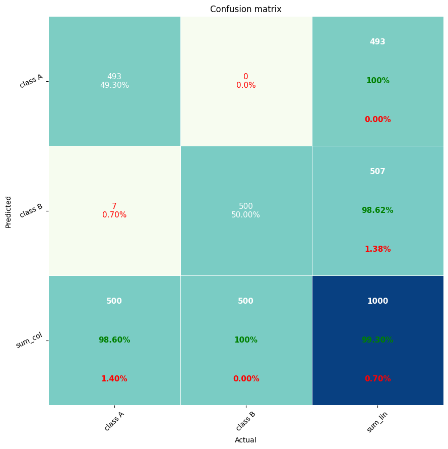
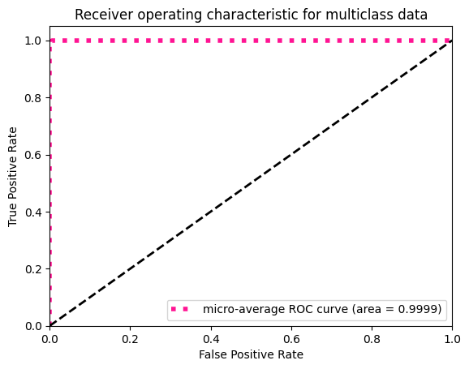

# __Specific Test V Exploring Transformers__

An Implementation of pretrained SWIN_t using PyTorch for classifying the images to two classes: with and without substructre.

## **Dataset**:

A set of simulated strong gravitational lensing images with and without substructure. 

## **Solution**:

The notebook can be open on [GoogleColab](https://colab.research.google.com/drive/1yeRYmeJ3k1sJPX6fgkyPZ1yXqff4tjHc?usp=sharing)

## **Augmentations**:

1. Random Horizontal Flip
2. Random Vertical Flip
3. Random Rotation
4. Center Crop

I've used the previosly mentioned augmentations to double the size of the dataset, which resulted in significant improvments in the validation accuracy and AUC metrics.

## **Model Weights**: [classification_model.pth](https://drive.google.com/file/d/1H6VFTtucxQ20tJNB53kUCNLIzcoU7B-j/view?usp=sharing)

## **Results**:

| S.No | Metric              | Value  |
| ---- | ------------------- | ------ |
| 1.   | Validation Accuracy | 99.3%  |
| 2.   | macro-average AUC   | 0.9999 |
| 3.   | micro-Average AUC   | 0.9999 |
| 4.   | validation loss     | 0.0172 |

### **Confusion Matrix**:

### **ROC Curve**:

 

