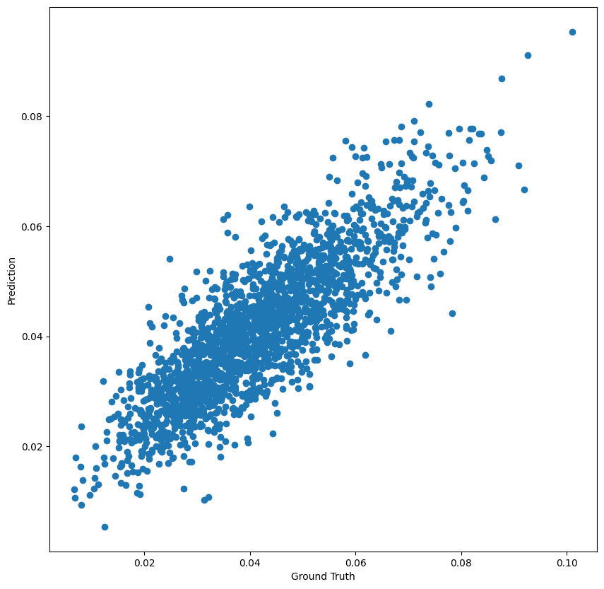

## __Specific Test III. Learning Mass of Dark Matter Halo__

An Implementation of pretrained MobileNetV3 using PyTorch for classifying the images into lenses using PyTorch.

### **Dataset**:

This Dataset consists of strong lensing images for cold dark matter with subhalo substructure. For each lensing image the corresponding fraction of mass in dark matter substructure is provided.

### **Solution**:
The notebook can be open on [GoogleColab](https://colab.research.google.com/drive/1KFSvHa7zIvhJHG7YhDSbF8CZkIXEIKWH?usp=sharing)

### **Augmentations**:

1. Random Horizontal Flip
2. Random Vertical Flip

I've used the previosly mentioned augmentations to regularize the dataset, which resulted in significant improvments in the validation MSE metric.

### **Model Weights**: [deep_regression_model.pth](weights/Regression_m.pth)

### **Results**:

| S.No | Metric              | Value  |
| ---- | ------------------- | ------ |
| 1.   | Training MSE       | 6.005e-6 |
| 2.   | Testing MSE        | 6.147e-5 |

### **__Predicted vs Actual Mass__**:

