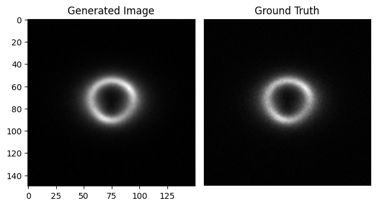
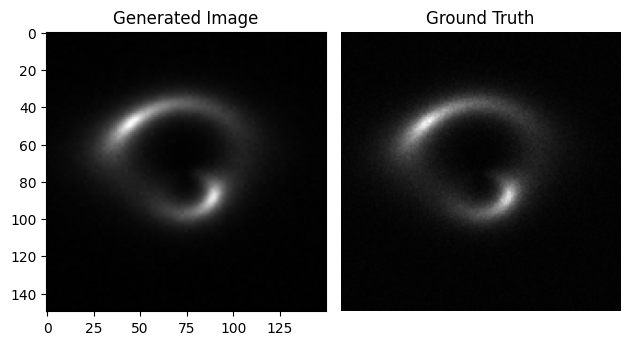
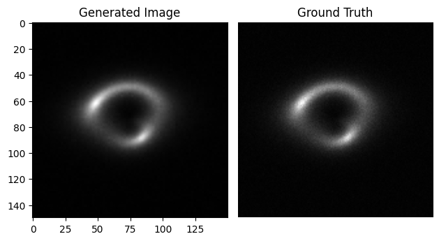

## __Specific Test VI. Image Super-resolution__

An Implementation of SRResNet using PyTorch for super-resolution of images.[^1]

### Trials

1. Implemented a discriminator in the structure mentioned in the paper, and optimized the generator network with **adversarial loss**, but foun that it decreased the preformance and produced a weird pixelation effect. Not to mention the extended training time due to the need of optimizing the discriminator.

2. Implemented **VGG-Content loss** to capture perceptual similarity between images and penalize the network with the MSE loss between the embeddings of the upscaled image and its ground truth. This also decreased the preformance, whilst the training time took longer due to the need of inferring a VGG-19 Network in every training step.

3. Removed batch normalization following the findings of the follow up architecture **“ESRGAN”**[^2] that BN layers produce visible artifacts in the upscaled image. And found improvements in the resulting upscaled images and corresponding PNSR and SSIM metrics.

4. Changed the ReLU activation function to **PReLU** activation function, which resulted in a minor improvement in the validation metrics.

5. Implemented **Learning Rate Scheduler** that decreased the LR by a factor of **0.1** if no improvements in validation loss occurred within an Epoch. resulted in a minor improvment with no real damage to the training time.

6. Switched the **Pixel Shuffle** layer with **Trasnposed Convolution** layer, which didn't result in any improvements.

7. switched the **Pixel Shuffle** layer with an **Upsample** layer followed by a convolution, which didn't result in any improvements.

8. Decreased the number of **Residual Blocks** from 16 to 1, which resulted in a minor improvement in the validation metrics, and a faster convergence.

9. Increased the number of **channels** across the network from 64 to 128, which decreased the validation metrics.

### **Dataset**:
The dataset comprises strong lensing images with no substructure at multiple resolutions: high-resolution (HR) and low-resolution (LR).

### **Solution**:
The notebook can be open on [GoogleColab](https://colab.research.google.com/drive/1UOhPnVv-YDzBvhI5va-PipOj3BV9LHMT?usp=sharing)

### **Model Weights**: [superres.pth](/weights/superres.pth)

### **Results**:
| S.No | Metric          | Value    |
| ---- | --------------- | -------- |
| 1.   | Validation MSE  | 5.859e-5 |
| 2.   | Validation PSNR | 42.3233  |
| 3.   | Validation SSIM | 0.98295  |  

#### **Generated Images vs Ground Truth**:

-

-

-

## __Citation__

If you find this repo useful, please consider citing the following paper:

[^1]: [Photo-Realistic Single Image Super-Resolution Using a Generative Adversarial Network](https://arxiv.org/abs/1609.04802)
[^2]: [ESRGAN: Enhanced Super-Resolution Generative Adversarial Networks](https://arxiv.org/abs/1809.00219)

